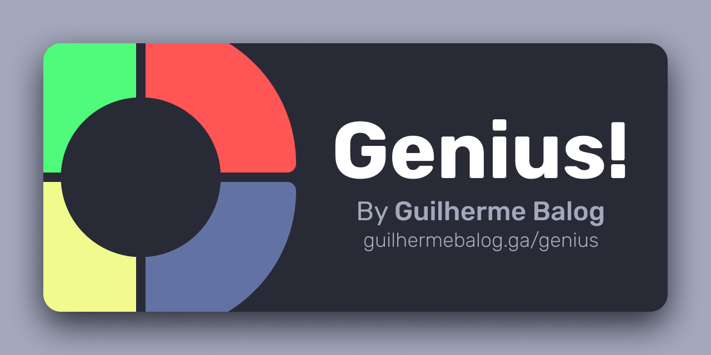

# Genius

Genius é um brinquedo clássico.

Ele toca uma sequência e você tem que repetir apertando os botões. E a sequência vai aumento progressivamente.



Você pode jogar [aqui no meu site](https://guilhermebalog.ga/genius)

Mas se quiser baixar e rodar na sua máquina, clone o repositório com

```bash
git clone clone https://github.com/GuilhermeBalog/genius.git
```

E acesse o arquivo `index.html` no seu navegador favorito!

> Confira o arquivo main.js para ver a implementação.
> Sinta-se livre pra dar um fork no repositório e adicionar suas ideias

*That's all folks! Keep coding!*
